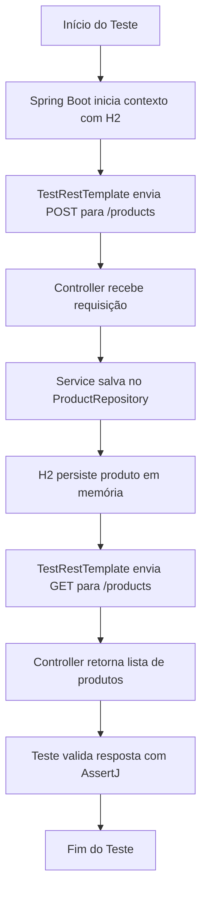

# 🧪 Spring Integration Test Demo

Este projeto demonstra como realizar **testes de integração** com **Spring Boot**, utilizando:

- **Spring Data JPA**
- **H2 Database** (banco de dados em memória)
- **TestRestTemplate** para chamadas HTTP reais
- **JUnit 5** e **AssertJ** para validação

---

## 📌 Funcionalidades
- Criar e listar produtos via API REST
- Persistência em banco H2 durante os testes
- Testes de integração simulando chamadas HTTP reais

---

## 📂 Estrutura de Pastas

```text
spring-integration-test-demo/
├── build.gradle.kts
├── src
│ ├── main
│ │ └── java/com/example/springintegrationtest
│ │ ├── SpringIntegrationTestDemoApplication.java
│ │ ├── controller/ProductController.java
│ │ ├── entity/Product.java
│ │ ├── repository/ProductRepository.java
│ │ └── service/ProductService.java
│ └── test
│ └── java/com/example/springintegrationtest
│ └── ProductControllerIntegrationTest.java
└── src/main/resources/application.properties
```
---

## 🚀 Executando o Projeto

### 1️⃣ Rodar a aplicação
```bash
./gradlew bootRun
```

### A API estará disponível em:

```bash

http://localhost:8080/products

```

## 🔍 Fluxo do Teste de Integração


